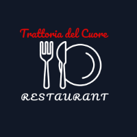

READsME.md Template for Your Web Project

# Trattoria del Cuore Restaurant

 ## 🚀 Overview

This project showcases the design for the website of Ele Restaurant, a fictional establishment located in Italy, dedicated to providing an exquisite dining experience. The website aims to capture the restaurant's elegant ambiance, highlight its delectable menu, and offer a seamless reservation process for potential diners. It serves as a digital representation of the restaurant's brand and offerings.

## 🛠️ Technologies Used

- HTML5
- CSS3
- JavaScript
- [Potentially a Frontend Framework/Library] (e.g., React, Vue.js, Angular if the design were implemented)
- [Potentially a Backend Technology] (e.g., Node.js, Python, PHP if dynamic features like reservations were implemented)
- Google Maps API (for location display)

## 🎯 Features (Based on the Design)

- **Visually Appealing Hero Section:** Engaging banner with high-quality images and the restaurant's name.
- **Featured Dishes Showcase:** Highlighting signature menu items with enticing visuals and descriptions.
- **"Our Story" Section:** Providing background information and the restaurant's philosophy.
- **Image Gallery:** Displaying the restaurant's ambiance, food presentation, and overall experience.
- **Customer Testimonials:** Building trust through positive reviews from satisfied diners.
- **Easy Online Reservation System:** A user-friendly form or clear call-to-action for booking tables.
- **Clear Contact Information:** Providing address (Italy), phone number, and email.
- **Interactive Map:** Displaying the restaurant's location for easy navigation.
- **Informative Footer:** Including copyright information and social media links.

## 📸 Screenshots


*The elegant homepage showcasing the restaurant's brand.*


*A selection of the restaurant's signature dishes.*


*The user-friendly online reservation form.*


*Contact details and an interactive map of the restaurant's location in Italy.*

## ⚙️ Installation (If this were a development project)

### Prerequisites

- Node.js (if a Node.js backend is used)
- npm or yarn (Node.js package managers)
- A web browser

### Steps

1. Clone the repository:

   ```bash
   git clone [https://github.com/ArshakBadalyan/TrattoriadelCuoreRestaurants.git](https://github.com/ArshakBadalyan/TrattoriadelCuoreRestaurants.git)
Navigate into the project directory:

Bash

cd TrattoriadelCuoreRestaurants
Install frontend dependencies (if a framework like React was used):

Bash

npm install
# or
yarn install
Install backend dependencies (if a backend was implemented):

Bash

cd backend # Navigate to the backend folder (if it exists)
npm install
# or
yarn install
Configure environment variables (if applicable, e.g., for database connections or API keys). Create a .env file based on .env.example.

Start the frontend development server:

Bash

npm start
# or
yarn start
Start the backend server (if applicable):

Bash

cd backend
npm run dev # or a similar command defined in package.json
Open your browser and navigate to the address provided by the frontend development server (usually http://localhost:3000) to view the Ele Restaurant website.

🧪 Testing (If tests were implemented)
To run frontend tests:

Bash

npm test
# or
yarn test
To run backend tests:

Bash

cd backend
npm test
# or
yarn test
🤝 Contributing
We welcome contributions! Please follow these steps:

Fork the repository.
Create a new branch (git checkout -b feature-branch).
Make your changes.
Commit your changes (git commit -am 'Add new feature').
Push to the branch (git push origin feature-branch).
Create a new Pull Request.
📄 License
This project is licensed under the MIT License - see the https://www.google.com/search?q=LICENSE file for details.

📞 Contact
For any inquiries, please email your-email@example.com.

🛠️ Tips for Enhancing Your README.md
Project Name & Logo: Ensure a clear project name and include a relevant logo or banner image for visual appeal.
Badges: Add badges for build status, license, or version to provide quick insights into the project's health and status. You can use services like shields.io to generate these.
Visuals: Include relevant screenshots or GIFs to help users quickly understand the website's key features and design.
Contributing Guidelines: Clearly outline the process for others to contribute to your project, fostering an open and collaborative environment.
License Information: Explicitly state the project's license to inform users about usage rights and permissions.
Contact Information: Provide a clear way for users or potential collaborators to reach out with questions or feedback.
Live Demo Link: If the website is deployed, include a link to the live demo so users can experience it directly.
Tech Stack Details: Provide more specific details about the frameworks, libraries, and tools used in the project.
Code Style and Conventions: If applicable, mention any specific code style guides or conventions followed in the project.
Acknowledgements: If you've used any third-party libraries or resources, consider acknowledging them.